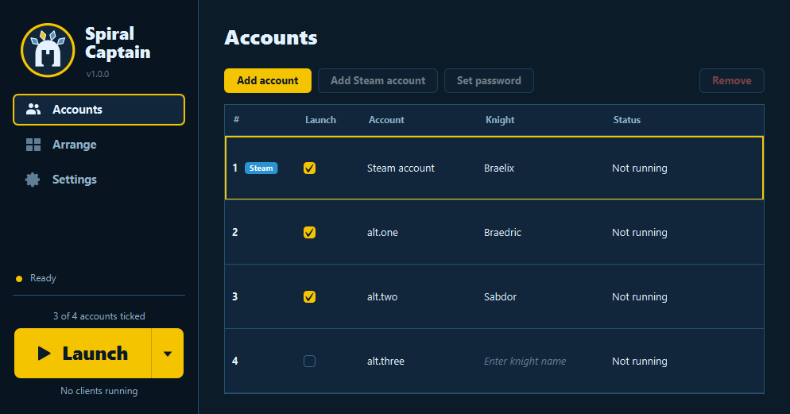
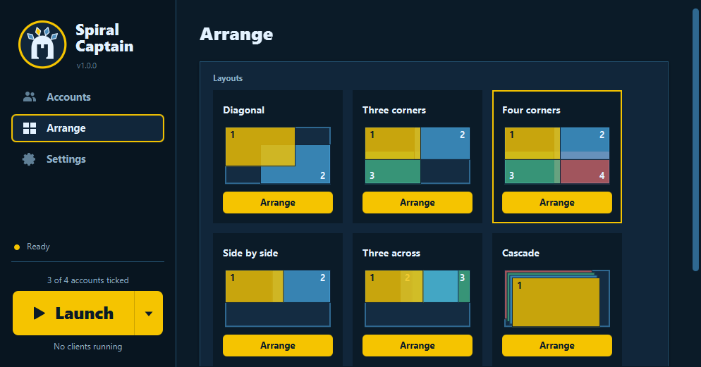
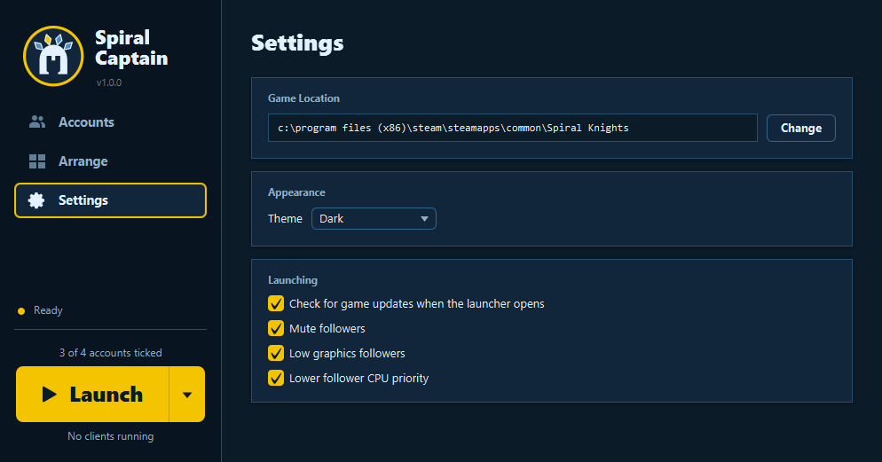

# Spiral Captain

A multi-account launcher for **Spiral Knights** on Windows. Keep all your accounts in one list,
launch them with one click straight to the right knight, and lay the game windows out on your
screen.

## Features

- Password accounts and your Steam account in one list, each logging straight in as its knight.
- Launch the ticked accounts, every account, or only the alts. The main account always starts
  first.
- Window layouts: corners, side by side, cascade, two monitors, or your own saved layout. The last
  one you used is applied by itself after every launch.
- Separate game settings for every account: keybinds, volume, resolution.
- Alts can start muted, on low graphics and at a lower CPU priority, so the main client stays
  smooth.
- Offers to update Spiral Knights when a patch is out.
- Light and dark themes, or follow Windows.

## Download

Get the latest version from the [Releases page](../../releases/latest):

- **`SpiralCaptain-<version>-x64-setup.msi`** installs Spiral Captain, with optional desktop and
  Start menu shortcuts.
- **`SpiralCaptain-<version>-portable.exe`** is a single file you can keep anywhere. It unpacks
  itself into a folder next to it the first time you run it and keeps its accounts there too.

You need 64-bit Windows 10 or 11 and Spiral Knights installed. Java is not needed.

Spiral Captain is not code-signed, so Windows may show "Windows protected your PC" the first time.
Click **More info**, then **Run anyway**.

## Getting started

1. Press **Add account**, type the account name, then **Set password**. For the account Steam is
   logged into, use **Add Steam account** instead.
2. Type each account's knight name in the **Knight** column, or leave it empty to pick in game.
3. Drag the account you play on to the top. Account **#1** is the main client.
4. Tick the accounts you want and press **Launch**.
5. On the **Arrange** page, press **Arrange** on a layout. It is used again automatically next time.

## Is this allowed?

Playing several Spiral Knights accounts at once is allowed; software that plays the game for you or
changes it is not. Spiral Captain only starts the unmodified game with its own login options and
moves windows through Windows. It never reads, changes or sends input to the game. Use it at your
own risk.

## Privacy

Your passwords are never stored. Spiral Captain keeps only the scrambled form the game itself sends
when you log in, encrypted so it only works for your Windows user on this PC. It has no analytics,
and the only thing it connects to is the game's own update server.

## License

[MIT](LICENSE)

Spiral Captain is a fan-made tool. It is not affiliated with, endorsed by or supported by Grey
Havens or Three Rings. Spiral Knights and its assets are the property of their respective owners.
